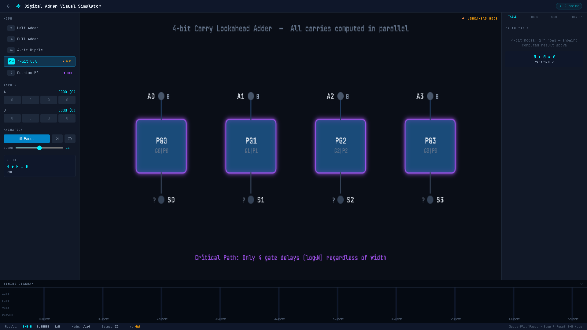

<div align="center">
  
  
  <h1>⚡ LogicForge — Digital Adder Visual Simulator</h1>
  <p><em>A cinematic, interactive logic engine bridging classical hardware and quantum concepts.</em></p>
</div>

---

## 💡 The Vision
Learning about computer architecture is often boring and static. We built an interactive, cinematic digital logic simulator designed specifically to make hardware visually intuitive. 

Instead of just showing instantaneous mathematical answers, **LogicForge** lets you watch the "electricity" physically flow through the logic gates, demonstrating real hardware propagation delay ($\Delta t$) step-by-step.

## ✨ Core Features
- **Visual Propagation Engine:** Watch data pulses travel through wires.
- **Five Distinct Architectures:** Fluidly switch between Half Adder, Full Adder, 4-bit Ripple Carry, 4-bit Carry Lookahead (CLA), and a reversible Quantum Full Adder (using Toffoli & CNOT gates).
- **Interactive Verification:** Live bit-toggling with an actively highlighting Truth Table that proves computations dynamically.
- **Performance Analytics:** An oscilloscope timing diagram and live gate-depth metrics that visually prove why lookahead logic is 2x faster than ripple structures.

## ⌨️ Simulator Controls (Demo Tips)
Use these shortcuts to perfectly demo the engine:
- `Spacebar` : Play or Pause the animation pulse
- `→` (Right Arrow) : Step forward precisely one gate delay at a time
- `R` : Reset the simulation
- `1 - 5` : Instantly switch between the 5 architecture modes

## 🛠️ How to Run Locally
We built this locally using modern web tools (Vite, React, TypeScript, TailwindCSS).

1. Install dependencies:
   ```bash
   npm install
   ```
2. Start the development server:
   ```bash
   npm run dev
   ```
3. Open `http://localhost:5173/` in your browser and click **Launch Simulator**!
